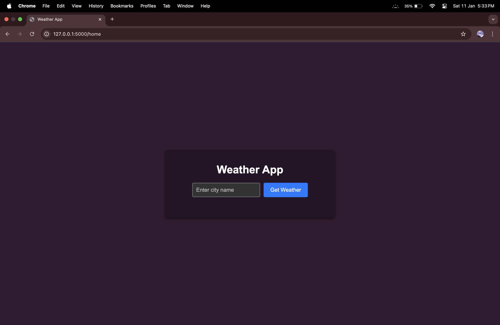
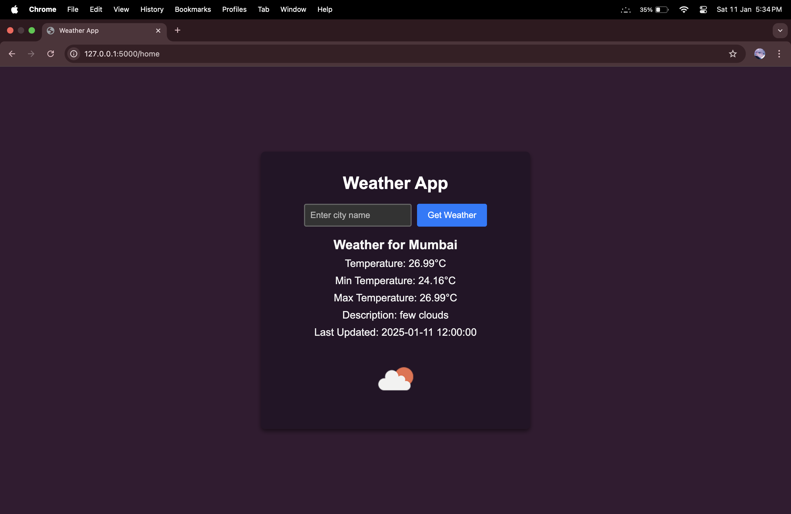

# Weather App

A Flask-based weather application that fetches real-time weather data from the OpenWeather API. Users can enter a city name to view current weather information, including temperature, weather description, and more.

## Features

- Fetch real-time weather data for any city using the OpenWeather API.
- Displays temperature, minimum and maximum temperatures, weather description, and the last update time.
- Simple and clean user interface.

## Prerequisites

To run this application, ensure you have the following installed:

- Python 3.x
- Flask
- Requests
- Python-dotenv

## Installation

1. Clone the repository:
   ```bash
   git clone https://github.com/Rahil71/Weather-App.git
   cd weather-app
   ```

2. Create a virtual environment and activate it:
   ```bash
   python -m venv venv
   source venv/bin/activate   # On Windows: venv\Scripts\activate
   ```

3. Install dependencies:
   ```bash
   pip install -r requirements.txt
   ```

4. Create a `.env` file in the project root and add your OpenWeather API key:
   ```
   API_KEY_OpenWeather=your_openweather_api_key
   ```

## Usage

1. Run the Flask app:
   ```bash
   python app.py
   ```

2. Open your web browser and navigate to:
   ```
   http://127.0.0.1:5000/home
   ```

3. Enter a city name to fetch and display the weather data.

## File Structure

```
weather-app/
├── static/
│   └── style.css         # Contains the CSS for styling the frontend
├── templates/
│   └── index.html        # HTML template for the application
├── app.py                # Main Flask application
├── .env                  # Environment variables file (API key)
├── requirements.txt      # Dependencies list
└── README.md             # Project documentation
```

## Technologies Used

- **Backend**: Flask
- **Frontend**: HTML, CSS
- **API**: OpenWeather API

## Example Screenshot




## Notes

- Ensure the `.env` file is not included in your version control to keep your API key secure.
- For the OpenWeather API, you can sign up at [OpenWeather](https://openweathermap.org/) and generate your API key.

## License

This project is licensed under the MIT License. See the LICENSE file for details.

## Contributing

Contributions are welcome! Please fork this repository and submit a pull request for any improvements or bug fixes.

## Contact

For any questions or suggestions, feel free to contact:
- Email: rahilshaikh7117@gmail.com
- GitHub: [Rahil71](https://github.com/Rahil71)

